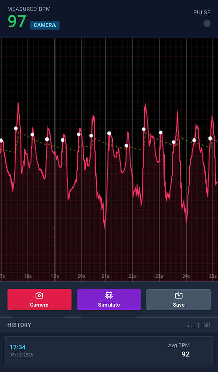
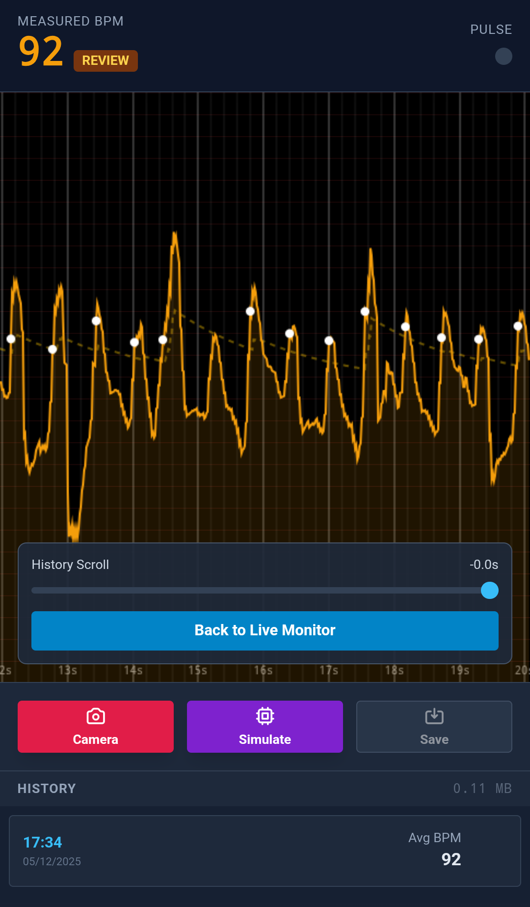

# heart-rate
Heart rate monitor and recorder

**Try it:** https://raw.githack.com/SMUsamaShah/heart-rate/claude/offline-pwa-setup-oFAtx/index.html

I needed this because yesterday my heart rate shot to 200 (jolted off a nap in a train) and most apps failed to read it, including Google Fit. I could feel my heart pounding crazily but I couldn't actually check it.

- Records the whole graph of upto last 3 minutes.
- Export all saved records.
- Export a saved record as an image.

(Vibe coded with Gemini 3 Pro, 2nd or 3rd attempt, many prompts)

